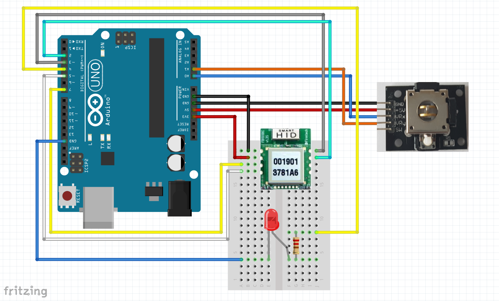

Audio Controller with Bluetooth HID
==============

youtube
--
https://youtu.be/4YT9UkCfl0Q

How to buy FB155BC Module [Korean]
--
http://www.devicemart.co.kr/1065519

user manual[Korean lanague]
------
http://firmtech7.cafe24.com/bizdemo4649/manual/fb155bc_s_hid.php

How to use the joystick in arduino[Korean lanague]
------
http://chandong83.blog.me/220846940517

##Joystick connection MAP

>GND    -    GND

>+5V     -    5V

>VRx     -    A0

>VRy     -    A1

>SW      -   N.C(사용 안 함)

##FB155BC connection MAP
>1.GND      -  GND

>2.VCC       -  3.3V

>3.STATUS  -  7

>4.MULTI    -  5

>5.NC        -  NC

>6.HID ST  -  NC

>7.TXD      -  2

>8.RXD      -  3

##Other connection MAP
>LED +   -   4

>LED -    -   GND
